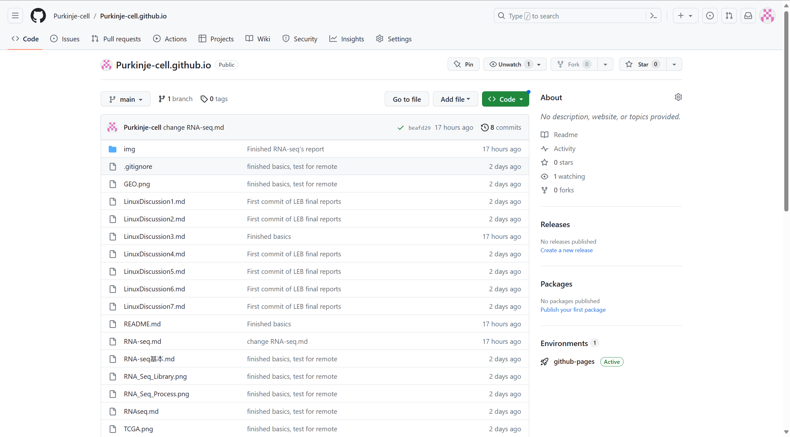

# Github Pages 建立个人网页

作者：易鼎程

### GitHub Pages 简单介绍

GitHub Pages是GitHub公司提供的一项可用于建立个人网页的免费站点托管服务，它直接从GitHub上的仓库获取HTML、CSS和JavaScript文件，通过自动的构建过程运行文件，然后发布网站。

GitHub Pages提供一个`github.io`域名作为站点托管域名，假如个人拥有其他域名，也可以使用这些域名来托管站点。

GitHub Pages 的一个优势是它允许使用 Jekyll 站点生成器，并直接解析 Markdown 文件来创建网站。GitHub Pages 还提供了较多的默认主题，用户可以在这些主题中选择一个来建立一个漂亮的网页。

### 创建 GitHub Pages 站点

GitHub Pages 提供了几种方式来创建一个站点。首先，可以从一个已经有的存储库来创建一个站点。其次，可以在现有存储库上建立一个站点。我们小组选择通过创建一个新的存储库来创建站点。

首先，创建一个新仓库，以用户名来命名，仓库名为 `Purkinje-cell.github.io`，然后设置使用 README 初始化仓库。之后，单击“创建存储库”，辩可以新建一个存储库用于站点配置。

GitHub Pages 需要一个入口文件来创建站点首页，它会自动查找 `index.html`、`index.md` 或 `README.md` 文件，并根据其内容渲染页面。

通过这种方式，我们小组将之前所有的讨论报告上传至 GitHub 存储库中，然后使用 GitHub Pages 来进行站点创建，并将其设置为 Public 存储库（所有人可见）。然后，我们就可以通过 `Purkinje-cell.github.io` 这一域名，通过各大浏览器进行访问。

以下是存储库的示例图

### 使用 Jekyll 向 GitHub Pages 站点添加主题

Jekyll 是一个静态站点生成器，内置 GitHub Pages 支持和简化的构建过程。 Jekyll 使用 Markdown 和 HTML 文件，并根据您选择的布局创建完整静态网站。 Jekyll 支持 Markdown 的使用。在 Jekyll 的支持下，我们可以直接使用 Markdown 的语法，方便的创建网页。

Jekyll的官方网站是 [Jekyllcn.cn](jekyllcn.com)，它上面提供了详细的设置Jekyll的渲染方式的文档。我们根据文档和GitHub的指导，选用了jekyll-theme-cayman主题。以下是我们的主页情况。在上传原来讨论报告的过程中，我们还遇到的一个问题是原先讨论报告中插入的图片丢失的问题，后来我们选择了在存储库中添加img文件夹，保存需要用的图片的方式来解决。

