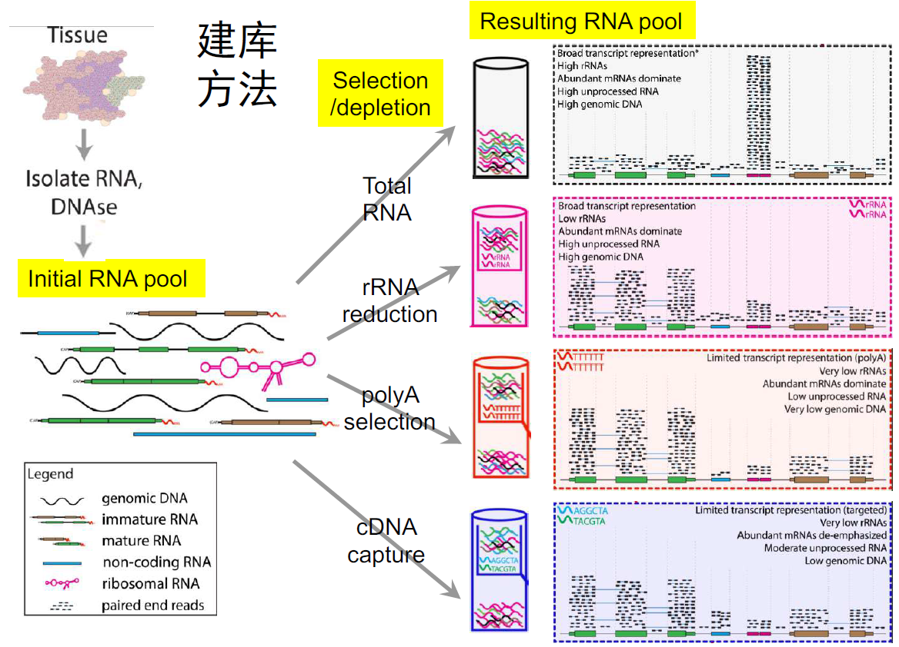
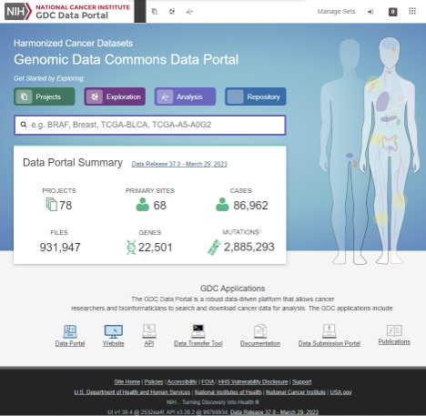
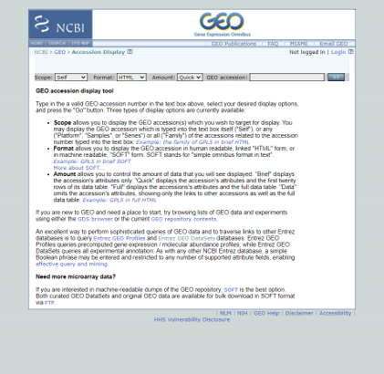

# RNA-seq 数据分析

## RNA-seq基本概念

* 不同的建库方法可以通过“采样”的方式获得细胞中不同的“样本”数据



### 数据获取

数据的获取有很多方式，GEO database是属于NCBI的转录组数据库（Gene Expression Omnibus），TCGA是属于NIH的人类肿瘤数据库，包括很多肿瘤（处理、对照）转录组数据，数据可以通过SRA-EBI-DDBJ数据库进行访问。







### RNA-seq的前期准备


参考文章： *<u>A survey of best practices for RNA-seq data analysis</u>*

## RNA-seq上游分析流程

该文档主要演示一种可以用来质控、比对、定量的过程，OS：`Ubuntu 18.04.6 LTS`，`Conda`环境

### 准备工作

* 数据的下载

  获取`RNA-seq`数据有很多方式，本试验采用NCBI的方式，通过搜索Bio-Project可以较为简便地获取感兴趣的测序数据，也可以通过查询相关`Pubmed`文献查看其raw data获取网址直接下载，TCGA等平台也有针对某些组织或实验方法的测序数据，但部分需要申请和额外权限。

  

  我们使用以下这篇文献的原始实验数据：

  

  根据文章底部提供的原始数据网址搜索GEO（Gene Expression Omnibus）即可得到全部[原始数据](https://www.ncbi.nlm.nih.gov/geo/query/acc.cgi?acc=GSE153637)：

  

  由于NCBI下载数据需要`sratools`（安装麻烦，也不好使），我们选择使用直接在由EBI维护的ENA数据库上提供免费的数据维护源下载，具体方法是根据GEO页面上的SRA代号即可，我们通过勾选相应的field即可显示可以直接下载的连接（建议安装一些高级的下载软件，比如aria2、aspera等协议工具等），也可以直接：

  ```bash
  wget -nc -c -b ftp://ftp.sra.ebi.ac.uk/vol1/fastq/SRR585/003/SRR5859403/SRR5859403.fastq.gz
  ```

  

  这样就可以下载得到原始的`fastq.gz`文件了。

* 软件的安装

  处理RNA-seq数据需要一些基础的软件，本次主要用到了`cutadapt`（去接头和低质量序列），`fastqc`（可视化质控），`STAR`（比对）以及`stringtie`（转录本定量）

  我们通过`conda`安装这些软软件，注意你的源的排序，首先检查：

  ```bash
  conda config --show channels
  ```

  其中应包括`bioconda`源，没有就手动添加：

  ```bash
  conda config --add channels bioconda
  ```

  

  包含源后，创建新环境专门用于处理RNA-seq数据：

  ```bash
  conda create -n rnaseq
  conda activate rnaseq
  ```

  之后安装最新版的需要的软件即可（不考虑相应的依赖版本，让`conda`自行解决）：

  ```bash
  conda install cutadapt STAR fastqc stringtie
  ```

  分别运行这些软件的帮助指令，如果都未出现`command not found`，那么就是环境配置成功了。

### 质控

质控过程主要通过你的需求关注`fastqc`软件为你提供的质量报告，一般我们普通的RNA-seq需要关注的是测序质量随测序位置的分布、序列接头，以方便在后续进行序列的去低质量序列和接头序列。

* 我们使用`fastqc`进行质检：

  ```bash
  gunzip SRR12129121_1_fastq.gz
  fastqc -o . SRR12129121_1.fastq
  ```

  关于`fastqc`的报告的其他解读，可以参考该篇[CSDN博客](https://blog.csdn.net/win_win223/article/details/127923307)。

  产生两个文件，其中一个是超文本html文件，我们可以通过在windows/mac端的shell运行：

  ```bash
  scp <用户名>@<ip>:<路径>/SRR12129121_1_fastqc.html <本地路径>
  ```

  下载到本地，再用默认浏览器打开，这里也推荐使用`Filezilla`的协议传输。

  检查结果：

  * 序列的质量情况

  

  * 序列的接头情况

  

  > 这里需要注意的是，不同的测序平台（platform）或建库方式可能使用不常用的接头，`fastqc`只能检测到Illumina平台常用的接头，需要注意对于公共数据我们需要针对GEO Data Processing栏关注文献的处理方法，也可以查看文献的Supplementary进行确定。
  >
  > 除接头外，有时还需要注意序列的长度分布信息，方便之后的比对工作。

* 对序列进行去低质量序列和接头序列

  对于低质量序列和接头序列，都可以使用`cutadapt`软件进行去除：

  `cutadapt`的功能很强大，具体的可以查看[官方说明文档](https://cutadapt.readthedocs.io/en/stable/)。

  此处由于该样本没有需要去除的末端低质量序列和接头序列，只使用命令进行一次演示，下面的指令同时进行了3’端接头序列（Trueseq 2 Universal Adapter）和末端低质量序列的去除：

  ```bash
  cutadpat -a AGATCGGAAGAGCACACGTCTGA -O 13 -e 0.1 -m 10 -q 10 -o SRR12129121_1.no_adapt.fastq -j 10 SRR12129121_1.fastq
  ```

  这是一种单端去除的方法，解读：

  * `-a`，制定adapter的序列
  * `-O`，制定最小的overlap的长度，一个adapter必须与序列中的末端有13个碱基的一致才会被剪切
  * `-e`，最大错误率
  * `-m`，剪切后最短的read长度
  * `-q`，去除末端质量<10（Phred Score）的序列
  * `-o`，输出fastq
  * `-j`，制定运行的线程，推荐8以下

  对于双端测序还可以使用pair-end同时去除的方法，具体的指令是加入一个`-o <output_1> -p <output_2> <input_1> <input_2>`的格式，所有的选项对应大写，具体见官方文档`Trimming  Paired-end Reads`

### 比对

基于参考基因组的比对的目的是对于得到的mRNA读段，需要知道这些细胞中抽样的结果来自怎么样的一个总体，这个总体的一个针对某些量的分布是什么样的，例如普通的RNA-seq表达分析实验关注转录本的Read Counts，或者关注TPM和FPKM，这样的指标反应的是转录本/基因的表达水平分布，这个过程就需要我们将Read与相应的已经注释的参考基因组片段对应起来。

* 参考基因组及注释

  比对之前需要先下载参考基因组：可以从`genecode`找到对应版本下载，注意UCSC版本：

  ```bash
  wget -bc https://ftp.ebi.ac.uk/pub/databases/gencode/Gencode_human/release_19/GRCh37.p13.genome.fa.gz
  wget -bc https://ftp.ebi.ac.uk/pub/databases/gencode/Gencode_human/release_19/gencode.v19.annotation.gtf.gz
  ```

  下载完成后`gunzip`解压。

* STAR Library Buildup

  在比对之前还有一个工序就是建索引，可以理解为将参考基因组提取信息并将每个contig进行拆分和建立标签，这样帮助一个Fragment快速选择对应拆分好的片段的种子再进行精细比对，加速了整个步骤，建库方法：

  ```bash
  nohup STAR \
  --runMode genomeGenerate \
  --runThreadN 18 \
  --genomeDir ./hg19 \
  --genomeFastaFiles ./GRCh37.p13.genome.fa
  --sjdbGTFfile ./gencode.v19.annotation.gtf
  --sjdbOverhang 99
  ```

  解释：

  * `--runMode`制定是建索引
  * `--sjdbOverhang`对应的是你的读段的长度-1最为合适，之前用`fastqc`检查的结果是100，这里用99最合适

  > 建索引过程比较漫长，但同一次实验一般使用同一个版本的注释及参考基因组类型，所以建索引过程一般只需要进行一次。

* STAR Alignment

  采用与原文献处理方式相同的工具`STAR`进行比对，STAR是一款RNA-seq比对工具，对于一般的转录本剪切位点有比对有较强的的灵敏度，具体的使用方法和问题解决可以参考[官方Manual](https://github.com/alexdobin/STAR/blob/master/doc/*STARmanual*.pdf)。

  这里使用双端比对的方式：

  ```bash
  nohup STAR \
  --runThreadN 18 \
  --outFilterType BySJout \
  --outSAMtype BAM SortedByCoordinate \
  --genomeDir ./hg19 \
  --readFilesIn SRR12129121_1.no_adapt.fastq SRR12129121_2.no_adapt.fastq \
  --outBAMsortingThreadN 4 \
  --outFileNamePrefix SRR12129121. &
  ```

  这是一个比较基础的比对方式，解释：

  * `–-outFilterType`根据splice junction对读段进行过滤，目的是筛去那些匹配不上剪切点的read
  * `--outSAMtype`，以bam输出并按坐标排序，后续软件需要
  * `--readFilesIn`，指定两个文件就是双端比对

* 比对结束后，可以通过检查`SRR12129121.Log.final.out`来检查比对结果：

  ```tex
                                   Started job on |       Jun 05 12:25:54
                               Started mapping on |       Jun 05 12:28:34
                                      Finished on |       Jun 05 12:33:30
         Mapping speed, Million of reads per hour |       355.49
  
                            Number of input reads |       29229536
                        Average input read length |       200
                                      UNIQUE READS:
                     Uniquely mapped reads number |       27271039
                          Uniquely mapped reads % |       93.30%
                            Average mapped length |       199.44
                         Number of splices: Total |       24816097
              Number of splices: Annotated (sjdb) |       24666103
                         Number of splices: GT/AG |       24637797
                         Number of splices: GC/AG |       154235
                         Number of splices: AT/AC |       17637
                 Number of splices: Non-canonical |       6428
                        Mismatch rate per base, % |       0.21%
                           Deletion rate per base |       0.01%
                          Deletion average length |       1.72
                          Insertion rate per base |       0.01%
                         Insertion average length |       1.41
                               MULTI-MAPPING READS:
          Number of reads mapped to multiple loci |       1501442
               % of reads mapped to multiple loci |       5.14%
          Number of reads mapped to too many loci |       4348
               % of reads mapped to too many loci |       0.01%
                                    UNMAPPED READS:
    Number of reads unmapped: too many mismatches |       0
         % of reads unmapped: too many mismatches |       0.00%
              Number of reads unmapped: too short |       449083
                   % of reads unmapped: too short |       1.54%
                  Number of reads unmapped: other |       3624
                       % of reads unmapped: other |       0.01%
                                    CHIMERIC READS:
                         Number of chimeric reads |       0
                              % of chimeric reads |       0.00%
  ```

### 定量

原文采用的方式是使用`R`的`GenomicAlignments`包中的`summarizeOverlaps`函数，该函数可以通过简单的外显子/基因水平计数得到raw counts：

```R
se <- summarizeOverlaps(exbygene, reads, mode="IntersectionNotEmpty")
```

这里我们使用`stringtie`同样可以得到raw counts，方法是首先运行`stringtie`：

```bash
stringtie SRR12129121.Aligned.sortedByCoord.out.bam \
-o SRR12129121.gtf \
-G gencode.v19.annotation.gtf \
-c 0.01 -m 100 -e
```

解释：

* `-c`，对应于每个转录本最少的覆盖度，至少要0.01
* `-m`，对应于transcript最小的比对结果长度，小于100的会被抛弃
* `-e`，只使用注释文件中的转录本，不推测新的

使用`stringtie`自带的脚本`prepDE.py`（位置一般在`<conda目录>/pkgs/stringtie-<版本>/bin`下），可以这样运行：

```bash
python prepDE.py \
-i sample_list.txt \
-g gene_count_matrix.csv \
-t transcript_count_matrix.csv
```

这里需要制定`sample_list.txt`，第一列为样本名称，第二列为定量的GTF文件路径：

```
Control_1 SRR12129121.gtf
```

运行后就得到了raw counts矩阵。

```bash
cat gene_count_matrix.csv | head
gene_id,SRR12129121
ENSG00000223972.5|DDX11L1,5
ENSG00000243485.5|MIR1302-2HG,3
ENSG00000284332.1|MIR1302-2,0
ENSG00000237613.2|FAM138A,0
ENSG00000268020.3|OR4G4P,0
ENSG00000240361.2|OR4G11P,0
ENSG00000186092.7|OR4F5,0
ENSG00000238009.6|ENSG00000238009,75
ENSG00000241860.7|ENSG00000241860,90
```

用`Excel`打开如下：


## RNASeq 下游分析

### 1. 差异表达基因分析

本次实验的数据来源是GEO数据库中GSE153637所标识的数据。这是一篇2021年发表在Nature Cancer上，研究RNA结合蛋白在白血病中的作用的文章。

Prieto, C., Nguyen, D.T.T., Liu, Z. et al. Transcriptional control of CBX5 by the RNA-binding proteins RBMX and RBMXL1 maintains chromatin state in myeloid leukemia. Nat Cancer 2, 741–757 (2021).

https://www.nature.com/articles/s43018-021-00220-w#citeas

本次我们使用DESeq2包进行差异表达基因分析，首先我们需要对数据进行预处理。

```R vscode={"languageId": "r"}
library(tidyverse)
library(pheatmap)
library(DESeq2)
library(readxl)
library(EnhancedVolcano)
```

```R vscode={"languageId": "r"}
rna_seq <- read_excel(
    "RNAseq.xlsx",
    sheet = "Readcounts"
)
```

简单观察数据，可以看到实验中共有三组，control, shRNA1, shRNA2，每组一共四个样本，一共是12个样本。样本中基因的数目都是32866个基因。

```R vscode={"languageId": "r"}
print(dim(rna_seq))
print(head(rna_seq))
print(tail(rna_seq))
```

#### (基因ID转换)

事实上，在表达量定量一步，我们常常使用的是人类基因组的注释文件(gtf格式)作为输入。这些文件几乎都是使用Ensemble ID作为基因的ID，而在差异表达分析中，我们常常需要使用基因的名字(Gene Symbol)作为分析的基础。因此，我们需要将基因的ID转换为基因的名字。这里我们使用的数据已经经过作者的ID转换，因此我们不需要再进行ID转换了。

ENSGxxxxxxxxx.x

其实ID转换的方法有非常多，许多生物信息网站上都有ID转换的功能，在R语言中也可以进行ID转换。例如可以使用ClusterProfiler包中的bitr函数进行ID转换。

```R vscode={"languageId": "r"}
#library(clusterProfiler)
#library(org.Hs.eg.db)
#genid <- bitr(rna_seq$Geneid, fromType = "ENSEMBL", toType = "SYMBOL", OrgDb = org.Hs.eg.db)
```

对数据进行一定的预处理，首先提取出基因名字，然后将基因名字作为行名，将样本名字作为列名。然后筛选掉部分不是基因的和表达量非常低的基因。

```R vscode={"languageId": "r"}
rna_seq <- rna_seq %>%
    mutate(Gene = ...1) %>%
    dplyr::select(-...1) %>%
    group_by(Gene) %>%
    summarise_all(sum) %>% # 这里的sum是对每一列进行求和，其实这个矩阵应该是已经整理好的不用。
    as.data.frame()

rownames(rna_seq) <- rna_seq$Gene
rna_seq <- rna_seq[, -1] # remove Gene column
print(head(rna_seq))
rna_seq <- rna_seq[-c(1:20), ] # 去掉前20行，这里面是一些不是基因的东西
rna_seq <- rna_seq[rowSums(rna_seq) >= 10, ] # 去掉在所有样本里面表达量小于10的基因
```

```R vscode={"languageId": "r"}
print(head(rna_seq))
print(dim(rna_seq))
```

从样本名中提取出实验处理分组信息用于DESeq2的差异表达分析

```R vscode={"languageId": "r"}
id <- colnames(rna_seq)
id <- as_tibble(id)
id <- id %>%
    mutate(type = str_extract(value, "(control|shRNA[12])"))
```

```R vscode={"languageId": "r"}
print(id)
```

使用DESeq2进行表达分析，得到差异表达基因的结果，然后对结果进行可视化，得到差异表达基因的火山图和热图。

```R vscode={"languageId": "r"}
dds <- DESeqDataSetFromMatrix(
    countData = rna_seq,
    colData = id,
    design = ~type
)
dds$type <- relevel(dds$type, ref = "control")
dds <- DESeq(dds)
```

#### 数据质控

在生物信息学分析中，数据质控是非常重要的一步。在RNAseq下游分析中我们也常常通过一些方法对数据进行质控。首先我们可以用PCA和聚类的方式对数据进行观察，看看数据是否有异常，例如是否有明显的分组，是否有明显的异常样本等等。

首先我们观察被敲除的RBMX基因的表达量，可以看到被敲除的基因的表达量都是非常低的，这也是符合预期的。

```R vscode={"languageId": "r"}
plotCounts(dds, gene = "RBMX", intgroup = "type")
```

之后我们可以使用PCA的方式对数据进行观察，可以看到数据的分组有点点问题

```R vscode={"languageId": "r"}
library(PCAtools)
vst <- rna_seq
meta <- data.frame(row.names = colnames(rna_seq), type = id$type)
p <- pca(vst, metadata=meta, removeVar = 0.05)
biplot(p)
```

```R vscode={"languageId": "r"}
res1 <- results(dds, name="type_shRNA1_vs_control")
res2 <- results(dds, name="type_shRNA2_vs_control")
```

使用EnhancedVolcano包绘制差异基因表达的火山图，使用pheatmap包绘制差异基因表达的热图。

```R vscode={"languageId": "r"}
EnhancedVolcano(res1,
    lab = rownames(res1),
    x = "log2FoldChange",
    y = "pvalue"
)
EnhancedVolcano(res2,
    lab = rownames(res2),
    x = "log2FoldChange",
    y = "pvalue"
)
```

```R vscode={"languageId": "r"}
res_filtered <- res2 %>%
    as.data.frame() %>%
    rownames_to_column("Gene") %>%
    filter(padj < 0.05 & abs(log2FoldChange) > 1)
dim(res_filtered)
print(head(res_filtered))
```

```R vscode={"languageId": "r"}
differential_genes <- res_filtered$Gene
diff_matrix <- rna_seq[sample(differential_genes, 50), ]
RBMX <- rna_seq["RBMX",]
diff_matrix <- rbind(diff_matrix, RBMX)
pheatmap(diff_matrix, scale = "row")
ggsave("heatmap.png", width = 10, height = 10)
```

```R vscode={"languageId": "r"}
diff_matrix <- rbind(diff_matrix, RBMX)
meta <- data.frame(row.names = colnames(diff_matrix), type = id$type)
p <- pca(diff_matrix, metadata=meta, removeVar = 0.05)
biplot(p)
```

### 2. GO富集分析

使用ClusterProfiler包进行GO富集分析，使用enrichplot包绘制GO富集分析的结果。这几个R包都是由南方医科大学余光创课题组开发的，可以在Bioconductor中找到。

https://yulab-smu.top/


```R vscode={"languageId": "r"}
library(clusterProfiler)
library(org.Hs.eg.db)
```

使用enrichGO函数进行GO富集分析，使用dotplot函数绘制GO富集分析的结果。

```R vscode={"languageId": "r"}
#gene ontology
go_bp <- enrichGO(gene = differential_genes,
                  OrgDb = org.Hs.eg.db,
                  keyType = "SYMBOL",
                  ont = "BP", # BP: biological process, MF: molecular function, CC: celluar component, ALL
                  pAdjustMethod = "BH",
                  pvalueCutoff = 0.05,
                  qvalueCutoff = 0.05)
dotplot(go_bp, title = "GO Biological Pathway", showCategory = 10)

```

```R vscode={"languageId": "r"}
differential_genes
```

```R vscode={"languageId": "r"}
go_bp
```

```R vscode={"languageId": "r"}
Gene Set Enrichment Analysis(GSEA)
```

```R vscode={"languageId": "r"}
res_filtered <- res2 %>%
    as.data.frame() %>%
    rownames_to_column("Gene") %>%
    filter(padj < 0.1 & abs(log2FoldChange) > 0.5)
differential_genes <- res_filtered$Gene
gsea_data <- res2[differential_genes, ] %>%
    as.data.frame() %>%
    rownames_to_column("Gene") %>%
    dplyr::select(Gene, log2FoldChange)
geneList <- gsea_data$log2FoldChange
names(geneList) <- gsea_data$Gene
geneList <- sort(geneList, decreasing = TRUE)
print(head(geneList))
print(length(geneList))
```

```R vscode={"languageId": "r"}
gse_bp <- gseGO(
    geneList = geneList,
    ont = "ALL",
    OrgDb = org.Hs.eg.db,
    keyType = "SYMBOL",
    pAdjustMethod = "BH",
    pvalueCutoff = 0.1,
)

```

```R vscode={"languageId": "r"}

```
